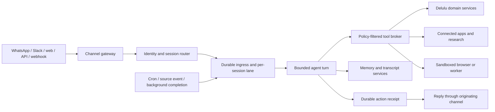

# Fully agentic content system: feasibility and production architecture

**Research date:** 2026-08-01
**Scope:** phone/text/voice-note onboarding, durable voice and person memory,
proactive source monitoring, multi-agent content work, review and scheduled
publishing, and outcome learning across workplace sources, messaging channels,
X, LinkedIn, and Instagram.

## Decision

Yes, Delulu can become a credible, always-on AI Head of Content. Roughly half
of the hard execution plane already exists: OAuth social connections, media,
drafts, scheduling, review, reliable target-level publishing, analytics,
automations, MCP, CLI, REST, PostgreSQL, and a deployable publisher. The next
product is not another social scheduler. It is a durable, evidence-backed
workflow layer above that execution plane.

The important qualification is that “fully agentic” cannot mean unrestricted
human-like browsing and unattended posting everywhere:

- X provides strong official research APIs, but full archive access is paid and
  automated actions require clear disclosure, express consent, opt-out, and
  policy-safe behavior. AI-generated automated replies require X's prior
  written approval. ([X Search Posts](https://docs.x.com/x-api/posts/search/introduction),
  [X automation rules](https://help.x.com/en/rules-and-policies/x-automation))
- LinkedIn supports publishing, but reading a member's posts and social actions
  uses the closed `r_member_social` permission. Its broader Community
  Management product is vetted, its development tier is limited to 500 calls
  per app and 100 per member per 24 hours, and social-action webhooks are
  disabled until Standard tier. ([Community Management overview](https://learn.microsoft.com/en-us/linkedin/marketing/community-management/community-management-overview?view=li-lms-2026-02),
  [access tiers](https://learn.microsoft.com/en-us/linkedin/marketing/increasing-access?view=li-lms-2026-05))
- Instagram's official API manages Professional accounts and their owned media,
  comments, mentions, hashtagged media, and insights. It cannot access consumer
  accounts or act as a general home-feed reader. Serving accounts Delulu does
  not own requires Advanced Access for relevant permissions.
  ([official Instagram API collection](https://www.postman.com/meta/instagram/documentation/6yqw8pt/instagram-api),
  [Insights requirements](https://www.postman.com/meta/instagram/documentation/6yqw8pt/instagram-api?entity=request-23987686-26e7999c-fc7e-44c8-8f71-ab2de8d35c32))

Therefore the clean product promise is: **always-on within explicitly connected
and permitted sources, proactive in suggesting work, and autonomously
publish-capable only inside a user-defined policy envelope.** It should not
promise to reproduce a person's unrestricted scrolling feed.

## What Delulu has and what is missing

| Area | Current capability | Gap for this product |
| --- | --- | --- |
| Social execution | Ten provider adapters, OAuth connections, media rules, drafts, scheduled targets, publishing, partial-failure handling | Platform access reviews; X research ingestion; LinkedIn/Instagram research constrained by official APIs |
| Safety | Workspace roles, post reviews, encrypted provider credentials, idempotent target publishing | Per-action autonomy policy, risk scoring, approval expiry, emergency stop, consent ledger |
| Durable work | PostgreSQL `jobs` table with leases, retries, run time, and unique idempotency key | `JobPayload` is intentionally limited to publish/media/membership work; general agent runs and rituals need their own workflow domain |
| Automations | Durable Instagram comment/story-reply DM flows and webhook delivery claims | No general event-to-agent workflow, recurring rituals, source connectors, or proactive suggestion engine |
| Context | Posts and transcriptions have PostgreSQL full-text indexes | No conversation thread, source document, citation, voice profile, fact memory, checkpoint, or retrieval policy |
| Analytics | Cached analytics domain plus live Instagram period/media insights | No normalized X/LinkedIn outcomes, edit-diff learning, experiment model, or defensible attribution |
| Identity | Clerk-subject JIT user and personal-workspace provisioning | No phone-native identity, verified number table, device/passkey binding, channel identity linking, or recovery policy |
| Deployment | Postgres + migrations + API + publisher + app; hosted edge/queue alternative | Separate connector-sync and agent-workflow workers, scheduler, model gateway, policy service, and workflow observability |

These gaps should be added as new bounded modules. Do not turn the publisher's
small, deterministic job union into a general AI queue; publishing reliability
and agent experimentation have different failure, replay, and audit semantics.

## What a truly agentic surface actually is

The earlier workflow description is necessary but not sufficient. A real
multi-surface assistant is not a chatbot attached independently to WhatsApp,
Slack, and a web app. It is a small agent operating system with messaging
channels at its boundary.

The source architectures reviewed for this report converge on the same narrow
waist:



The model is only one component. The system around it owns identity,
serialization, permissions, retries, checkpoints, approvals, isolation, and
delivery. Without that surrounding system, an apparently impressive tool loop
will eventually double-post, mix two users' context, lose work during a
restart, or take an action after consent has changed.

### Source-level findings from general assistant runtimes

Two active open-source assistant runtimes were inspected locally at pinned
commits rather than inferred from their landing pages:

- **Runtime A, commit `618f3298c7dc00a41549e4dec41d8412f651624b`.**
  Its channel plugins normalize provider events, route channel/account/peer and
  thread identities into canonical session keys, durably claim inbound events,
  serialize work by session lane, and record durable outbound delivery intent
  and receipts. Relevant source is in
  `src/channels/plugins/types.plugin.ts`,
  `src/routing/resolve-route.ts`, `src/routing/session-key.ts`,
  `src/channels/message/durable-receive.ts`,
  `src/channels/message/ingress-queue.ts`, and
  `src/channels/turn/durable-delivery.ts`.
- Runtime A constructs each turn's tool surface from agent, sender, channel,
  model, sandbox, scheduling, provenance, and runtime grants. Policy layers are
  applied before the model sees tools. Plugins must declare tool contracts.
  This is materially safer than showing every tool and asking the prompt not to
  misuse them. Relevant source is in
  `src/agents/embedded-agent-runner/run/attempt-tool-base-prepare.ts`,
  `src/agents/tool-policy-pipeline.ts`, and
  `src/plugins/registry-registrars-tools-hooks.ts`.
- Runtime A separates transcript compaction, project memory, cron wakes,
  ephemeral system events, subagent state, and message delivery. Its own source
  explicitly treats some system-event queues as process-memory-only; durable
  proactive work instead lives in cron/state/task records. Relevant source is
  in `src/agents/compaction.ts`, `src/agents/project-memory-bootstrap.ts`,
  `src/cron/service.ts`, `src/infra/system-events.ts`, and
  `src/agents/subagent-registry.ts`.
- **Runtime B, commit `e08870f62c5904461a9249ec978b8aa0b40cc3d0`.**
  It derives deterministic sessions from profile, platform, workspace/server,
  conversation type, conversation ID, thread ID, and optionally participant.
  It explicitly protects against cross-user history bleed. Relevant source is
  in `gateway/session.py`.
- Runtime B keeps one active run per session and queues or redirects follow-up
  messages. Reset and stop commands bypass the ordinary busy guard while
  preserving ordering. The model/tool cycle is bounded by both per-turn and
  shared iteration budgets; invalid tools and malformed arguments become tool
  errors rather than unsafe execution. Relevant source is in
  `gateway/platforms/base.py` and `agent/conversation_loop.py`.
- Runtime B treats memory providers, skills, plugins, MCP servers, cron jobs,
  delegation, and durable multi-agent boards as different extension and
  execution modes. A child agent running in the parent process is not treated
  as restart-safe work. Relevant source is in `agent/memory_manager.py`,
  `tools/registry.py`, `cron/scheduler.py`, `tools/delegate_tool.py`, and
  `tools/kanban_tools.py`.

The reviewed closed product's first-party documentation confirms the same
product shape without exposing its internals: messaging transports point to a
canonical assistant account; an unknown phone number can create a provisional
account; verified account merging preserves the selected account's memory,
recipes, integrations, and messaging bindings; recipes bundle onboarding with
required integrations; MCP adds tools; and API/webhook input is processed as
another assistant message. Those are product-behavior claims, not proof of its
internal implementation.

### What to reuse and what not to copy

Delulu should adapt these invariants, not fork a general desktop/personal-agent
runtime into the hosted product.

Reuse the architecture:

- channel-neutral envelopes and replies;
- canonical identity and deterministic session routing;
- one active turn per session plus a durable pending-input policy;
- a bounded model/tool loop;
- policy-filtered typed tools;
- explicit immediate, scheduled, event-triggered, and delegated execution
  modes;
- memory that is distinct from the transcript;
- durable delivery receipts and restart recovery;
- isolated browser/worker execution;
- observable costs, decisions, tool calls, and outcomes.

Do not reuse the deployment assumptions:

- local files or per-user SQLite as the hosted source of truth;
- an unrestricted shell as a default production tool;
- process-local timers or subagents for business-critical scheduled work;
- one global credential/config home per assistant process;
- a single prompt containing every integration and instruction;
- consumer account scraping as the foundation of social research.

Delulu is multi-tenant, already has PostgreSQL and typed social-domain
services, and already owns a reliable publisher. The clean design is a
Delulu-specific Agent Surface that calls existing product services through
typed tools. The existing publisher remains the only component allowed to
perform social writes.

## Delulu Agent Surface

### 1. Channel gateway

Every adapter converts provider-specific input into one versioned envelope:

```ts
type InboundEnvelope = {
  id: string;
  workspaceId?: string;
  channel: "whatsapp" | "slack" | "web" | "api" | "webhook";
  channelAccountId: string;
  externalConversationId: string;
  externalThreadId?: string;
  externalSenderId: string;
  senderBindingId?: string;
  eventKind: "message" | "command" | "reaction" | "source_event" | "wake";
  text?: string;
  attachments: InboundAttachment[];
  providerEventId: string;
  occurredAt: string;
  replyRoute: ReplyRoute;
  trust: "verified_user" | "workspace_member" | "unbound" | "system";
};
```

The adapter verifies webhook signatures, stores the raw provider event in an
encrypted short-retention audit record, deduplicates by provider event ID, and
acknowledges quickly. It does not invoke a model in the webhook request.

Provider output is also normalized. Long messages, files, threads, interactive
buttons, typing indicators, and approval controls remain adapter concerns. The
agent runtime returns semantic reply blocks rather than provider payloads.

### 2. Canonical identity and account binding

The agent belongs to a canonical Delulu user/workspace, not to a phone number or
Slack channel. Channel identities are revocable bindings:

- `agent_accounts` owns the assistant persona and plan;
- `channel_accounts` identifies a connected WhatsApp business number, Slack
  app installation, web account, or API key;
- `channel_identities` binds verified external senders to Delulu users;
- `conversation_bindings` defines which agent/workspace a DM, channel, group,
  or thread routes to;
- `provisional_accounts` holds limited phone-first onboarding state;
- `account_merge_requests` verifies and atomically moves channel bindings while
  preserving the selected account's memory and integrations.

An unrecognized number may get a provisional, read-only concierge experience.
It must not inherit an existing user's integrations or publishing authority
until verification and explicit linking finish. Slack installation does not
make every workspace member an authorized publisher; role and channel policy
still apply per sender.

### 3. Session router and isolation

A session key must be deterministic and tenant-scoped. A suitable default is:

```text
workspace:{workspaceId}:agent:{agentId}:channel:{channelAccountId}:
conversation:{externalConversationId}:thread:{externalThreadId-or-root}
```

For group surfaces, policy determines whether participants share the thread
context or receive per-user sessions. The router must never fall back from a
missing sender/conversation identifier to a global channel session. Unknown or
malformed identifiers are rejected or isolated into a quarantine session.

`agent_sessions` stores routing and lifecycle state. `agent_events` is an
append-only log of user input, model output, tool calls, approvals, wakeups,
compactions, and delivery receipts. `agent_turns` provides the materialized
state of one bounded run. One active lease is allowed per session.

Follow-up behavior is explicit:

- **queue:** preserve every input in order;
- **coalesce:** replace pending low-value updates with the newest;
- **redirect:** inject an urgent user correction into the active run;
- **interrupt:** cancel the active run for authenticated stop/reset commands.

Default to queue for direct requests, coalesce for noisy source events, and
interrupt only for privileged control commands.

### 4. Bounded agent runtime

An interactive turn is a bounded loop, not an unbounded autonomous process:

1. lease the session and create a turn checkpoint;
2. resolve identity, policy, connected capabilities, relevant skills, and
   memory;
3. build a stable prompt prefix and a filtered tool catalog;
4. call the model;
5. validate requested tool name and arguments;
6. obtain approval if the policy requires it;
7. execute through the Tool Broker with an idempotency key;
8. append the result and receipt, then continue until a final response or
   budget boundary;
9. persist the transcript projection and release the session lane;
10. deliver reply blocks and record provider delivery receipts.

Each turn has iteration, token, money, wall-clock, and tool-call budgets. A
budget stop creates an honest partial result and checkpoint. Model/network
retries consume a different budget from successful reasoning iterations so a
provider outage cannot silently spend the task budget.

### 5. Tool Broker

Every capability is a typed, versioned tool with a centrally enforced
contract:

```ts
type ToolDefinition = {
  name: string;
  inputSchema: JsonSchema;
  outputSchema: JsonSchema;
  requiredScopes: string[];
  risk: "read" | "draft" | "external_write" | "irreversible";
  idempotency: "required" | "supported" | "none";
  timeoutMs: number;
  execution: "api" | "worker" | "browser_sandbox";
};
```

The broker filters unavailable tools before model invocation, checks workspace
role, sender binding, connector scopes, autonomy policy, budget, and data
classification, then issues a short-lived capability token to the executor.
Tool output is treated as untrusted data, size-bounded, redacted, and stored
with provenance.

Initial Delulu tools should include source search/read, voice-profile retrieval,
idea creation, draft revision, media preparation, review request, scheduled-post
creation, analytics retrieval, and experiment recording. `publish_post` stays
behind the existing review and publisher domain. There is no generic production
SQL or host-shell tool.

Every external action returns an `ActionReceipt`: tool version, actor, policy
decision, input hash, idempotency key, external resource IDs, provider status,
timestamps, evidence links, and undo instructions where possible. A model's
claim that it acted is never completion evidence by itself.

### 6. Skills, recipes, plugins, and MCP

These are related but different:

- **skill:** a versioned instruction bundle, examples, required tools, scopes,
  and activation rules; loaded whole only when relevant;
- **recipe:** installable product configuration combining onboarding questions,
  integrations, triggers, a skill, and a default approval policy;
- **plugin:** trusted server code that adds adapters, hooks, or tools;
- **MCP connection:** an external tool/resource provider registered through the
  Tool Broker with explicit allowlists, timeouts, output limits, and credentials.

This gives Delulu a clean extension surface without making every connector a
core agent feature. A “daily founder brief” recipe can require Slack, calendar,
meeting-note, and social-research tools while using the same runtime as a
“turn this voice note into three platform drafts” recipe.

### 7. Memory and voice understanding

Memory should have four separately governed layers:

- **transcript:** chronological conversation and tool events;
- **working state:** current goal, plan, draft candidates, approvals, and
  checkpoints;
- **semantic memory:** evidence-linked facts about the person, company, audience,
  preferences, recurring themes, and relationships;
- **voice model:** measurable style constraints, examples, edits, banned patterns,
  platform-specific variants, and confidence.

Compaction only shortens model context; it must not overwrite durable facts or
workflow state. Extracted memories are proposals with source evidence,
confidence, visibility, expiry, and a user correction/deletion path. Sensitive
workplace facts default to workspace-private and cannot become public content
without an explicit policy decision.

The voice system learns more from edit diffs and accepted/rejected drafts than
from unconstrained generated examples. Retrieval assembles a bounded context
pack for the current task; it does not dump the user's entire history into each
prompt.

### 8. Durable workflows, wakes, and proactive behavior

Anything that must survive a restart is a `workflow_run`, not a sleeping agent:

```text
queued -> leased -> running -> waiting_approval -> scheduled
       -> running -> completed
       -> retry_wait -> queued
       -> failed | cancelled | expired
```

Cron schedules, connector webhooks, API messages, analytics updates, and
background-process completion all create the same durable `WakeEvent`. The
event is deduplicated, attached to a workflow/session, and claimed by a worker.
Workers use leases with heartbeat and stale-claim recovery. State transitions
and outbound enqueue happen transactionally through an outbox.

The workflow engine owns long-lived orchestration: research briefs, recurring
rituals, review waits, scheduled publishing, and post-performance follow-up.
The interactive agent runtime is invoked for bounded reasoning steps within a
workflow.

### 9. Subagents

Subagents are useful for parallel, bounded cognition such as separate X trend,
customer-story, and company-context research. They should:

- inherit a read-only snapshot rather than the parent's mutable session;
- receive a small allowlisted toolset, budget, deadline, and depth limit;
- be unable to publish, message third parties, or approve their own work;
- return structured evidence and candidate conclusions to the parent;
- be cancelled when the parent run is cancelled.

They are not the durable scheduler. If child work must survive worker death, it
becomes its own persisted workflow task with a lease and checkpoint.

### 10. Browser and computer execution

Browser or computer use is a last-mile executor for sources lacking a safe API,
not the default connector strategy. Run it in a per-run remote sandbox with an
ephemeral filesystem, encrypted browser-profile mount, network egress allowlist,
resource limits, screenshots/action trace, and an operator-visible kill switch.
Read and write permissions are separate. Authenticated writes require explicit
approval unless a narrowly defined recipe policy permits them.

The API edge, publisher, and agent worker must never share the browser sandbox's
host privileges. Social-platform terms and robots/access policies still apply;
browser automation does not make prohibited data access legitimate.

### 11. Observability and deployment

Use separate deployable roles sharing PostgreSQL and object storage:

- stateless channel/API gateway;
- connector sync workers;
- agent-turn workers;
- durable workflow scheduler/workers;
- browser sandbox pool;
- existing publisher workers;
- analytics and memory-indexing workers.

Trace every inbound event through session routing, model calls, policy
decisions, tool executions, approvals, publisher jobs, and outbound delivery.
Metrics include queue age, turn latency, model cost, tool success, approval
wait, duplicate suppression, stale lease recovery, receipt delivery, and
content outcome. Logs use hashed external identities and never include tokens,
raw credentials, or unrestricted memory text.

## End-to-end multi-surface flows

### WhatsApp voice note to reviewed multi-platform post

1. WhatsApp webhook verifies the provider signature and durably enqueues the
   audio message before acknowledging it.
2. The channel binding resolves the verified phone identity to a Delulu
   workspace and canonical agent session.
3. A media worker downloads, virus-scans, stores, and transcribes the audio;
   completion emits a wake event.
4. The agent retrieves voice constraints and recent relevant memories, then
   delegates bounded research to read-only child tasks.
5. The parent creates platform-specific drafts with citations and uncertainty,
   stores them through Delulu's draft service, and sends concise previews back
   to WhatsApp.
6. Interactive approve/edit buttons or plain-language replies update the same
   workflow regardless of channel.
7. Approval invokes the existing review/schedule domain. The publisher writes
   each target with its own idempotency key and returns action receipts.
8. Receipts are summarized in WhatsApp. Outcome collection later emits a wake
   event that updates experiment and voice-learning records.

### Slack event to proactive suggestion

1. A Slack event is signature-verified, deduplicated, and mapped by installation,
   workspace, channel, thread, and sender.
2. Channel policy decides whether the event is observable context, an explicit
   command, or forbidden. Ordinary chatter does not automatically trigger a
   model call.
3. A source-extraction workflow records a candidate content moment with its
   message permalink, access classification, and allowed audience.
4. A scheduled ritual clusters new candidates with calendar, meeting-note,
   product-change, and social-research evidence.
5. The agent sends a proactive suggestion into the configured Slack DM or
   channel. It does not expose private source text in a public channel.
6. The user's reply continues the same canonical workflow even if final approval
   later arrives from WhatsApp or the web app.

### API/webhook-triggered research

An authenticated API call is another ingress adapter. It creates a normalized
wake with structured context, not a privileged direct tool call. The same
identity, policy, budget, workflow, and receipt rules apply. This is how GitHub
changes, deploy events, CRM wins, or meeting completion can proactively become
content candidates without building special agent logic into every connector.

## Recommended implementation sequence for the Agent Surface

1. **Foundation:** envelope schemas, signature verification, channel bindings,
   deterministic session keys, append-only agent events, per-session leases,
   action receipts, and one Slack or WhatsApp adapter.
2. **Safe turn runtime:** bounded loop, static first-party tool registry, policy
   filtering, budgets, transcript compaction, and typed replies.
3. **Durable orchestration:** workflow runs, wake events, outbox, scheduler,
   approvals, retry/stale recovery, and background completion.
4. **Product intelligence:** evidence-linked memory, voice profiles, edit-diff
   learning, source connectors, and a research brief recipe.
5. **Extension surface:** recipe packaging, limited MCP connections, connector
   health, and tenant-level administration.
6. **Advanced execution:** read-only research subagents first; browser sandbox
   only for explicitly justified gaps; expanded autonomy only after receipt and
   rollback telemetry is trustworthy.

The first convincing vertical slice is not “supports every channel.” It is one
canonical account that can begin with a WhatsApp voice note, use Slack and
calendar evidence, create cited platform drafts, pause durably for approval,
publish through Delulu's existing publisher, return receipts to the originating
channel, and learn from the edit and result. Once that invariant works, new
channels are adapters rather than new products.

## Exact API feasibility

### Messaging and account entry

| Surface | Feasible official flow | Production caveat | Recommendation |
| --- | --- | --- | --- |
| SMS/MMS | A provider can receive inbound messages and associated media and can send replies; Twilio models incoming/outgoing messages and media as durable resources. ([Messages](https://www.twilio.com/docs/messaging/api/message-resource), [Media](https://www.twilio.com/docs/messaging/api/media-resource)) | US application-to-person traffic requires brand/campaign registration, verifiable opt-in, help and opt-out behavior; consent cannot be solicited through an unconsented SMS. ([A2P 10DLC](https://www.twilio.com/docs/messaging/compliance/a2p-10dlc/quickstart)) | Good universal text front door and notification fallback. Do not assume MMS audio support is consistent across countries/carriers. |
| WhatsApp | Cloud API supports programmatic inbound/outbound business messaging, webhooks, text and audio/voice media. ([Cloud API](https://www.postman.com/meta/whatsapp-business-platform/documentation/wlk6lh4/whatsapp-cloud-api), [message object](https://www.postman.com/meta/whatsapp-business-platform/folder/1dtuocp/messages-object)) | Requires a business portfolio, WhatsApp Business Account, business phone number, and permissions. Free-form business replies are limited to the rolling 24-hour customer-support window; later business-initiated messages require templates. ([status/window rules](https://www.postman.com/meta/whatsapp-business-platform/folder/fuaee8l/statuses-object)) | Best phone-native text and voice-note surface. Use Embedded Signup for customer-owned business assets; never silently create or take over a user's account. |
| Phone call | A voice provider can record an explicitly initiated call and deliver a recording callback. Twilio warns that recording-consent laws apply. ([Twilio Record](https://static0.twilio.com/docs/voice/twiml/record)) | Higher consent, retention, and support burden than voice notes. | Optional “call the agent” input after the text/WhatsApp path works. |
| iMessage | Apple's public Messages framework creates extensions that insert content into the user's compose field. An extension may send only while visible and after recent user interaction. ([Messages framework](https://developer.apple.com/documentation/messages), [send limitation](https://developer.apple.com/documentation/messages/msmessageerrorcode/sendwhilenotvisible)) | There is no public server API for an unattended assistant to read and reply through a consumer's personal iMessage account. A Messages extension is not a background bot. | Do not put iMessage on the critical path. Ship an iOS share/voice experience later, or use SMS/WhatsApp. |

### Phone-number-first identity and security

Delulu can create its own account from a verified phone number; it cannot create
the user's social or workplace accounts from that number. Those accounts must
already exist and be linked through their official OAuth or installation flow.

Recommended onboarding:

1. User texts the Delulu number or enters a phone number in the app.
2. Create an **untrusted pending contact**, not a fully authorized workspace.
3. Verify possession with a short-lived OTP, normalize to E.164, rate-limit by
   number/IP/device, apply geography controls and fraud detection, and store
   only after verification. Twilio recommends retry buffers (about one request
   per 30 seconds with backoff), masking PII, and verified-state tracking.
   ([verification best practices](https://www.twilio.com/docs/verify/developer-best-practices))
4. Resolve or create the Clerk user and personal workspace, then explicitly
   bind the verified number to that user. Clerk supports phone OTP and country
   allowlists, so Delulu can extend its present identity layer rather than
   replace it. ([Clerk authentication options](https://clerk.com/docs/guides/configure/auth-strategies/sign-up-sign-in-options))
5. Require a passkey/TOTP or trusted-device confirmation before connecting a
   new social account, changing the primary number, enabling autonomous
   publishing, exporting memory, or deleting an account. PSTN authentication is
   a restricted authenticator because of number reassignment, SIM swap, SS7,
   and forwarding risks. ([NIST SP 800-63B-4 authenticator guidance](https://pages.nist.gov/800-63-4/sp800-63b/authenticators/))
6. Capture separate, versioned consent for service messages, proactive
   notifications, and each autonomous action category. `STOP` must immediately
   suppress proactive SMS; channel opt-out must not delete the Delulu account.

Inbound `From` is a routing hint, not sufficient authorization for a sensitive
action. Every inbound message must resolve through `(provider account,
normalized sender, verified binding)` and sensitive requests must step up.

### Workplace and life-context connectors

| Source | What the official interface supports | Important boundary |
| --- | --- | --- |
| Slack | OAuth-scoped Events API over HTTPS or Socket Mode, plus Web API replies. Events are visible only where the authorizing user/bot has access. HTTP receivers must acknowledge within three seconds and queue work; event delivery is capped at 30,000 per workspace/app/hour. ([Events API](https://api.slack.com/apis/connections/events-api)) | Commercial distribution is expected through Slack Marketplace; newer non-Marketplace apps have stricter `conversations.history` and `conversations.replies` limits. ([2025 distribution/rate change](https://api.slack.com/changelog/2025-05-terms-rate-limit-update-and-faq)) |
| Notion | Public OAuth connections use a page picker; only selected/shared pages are available. Webhooks signal page/database/comment changes, are signed, may be aggregated/delayed/out of order, and require a follow-up API read for current content. ([public connections](https://developers.notion.com/guides/get-started/public-connections), [webhook delivery](https://developers.notion.com/reference/webhooks-events-delivery)) | Search is not a whole-workspace crawler and newly shared pages may not appear immediately. The API averages three requests/second per connection and returns `Retry-After` on 429. ([search limitations](https://developers.notion.com/reference/search-optimizations-and-limitations), [request limits](https://developers.notion.com/reference/request-limits)) |
| Google Calendar | OAuth-scoped event reads, per-calendar watch channels, and incremental sync tokens. Push is not 100% reliable, so periodic reconciliation is required; invalidated sync tokens return 410 and require a full sync. ([push](https://developers.google.com/workspace/calendar/api/guides/push), [incremental sync](https://developers.google.com/workspace/calendar/api/guides/sync)) | Calendar metadata is an idea signal, not permission to reveal attendee or meeting details in public content. Default to titles/times only and fetch descriptions/attendees only with a clear user setting. |
| Microsoft calendars | Microsoft Graph provides delegated OAuth, event change notifications, and delta queries for incremental calendar-view sync. ([change notifications](https://learn.microsoft.com/en-us/graph/outlook-change-notifications-overview), [event delta](https://learn.microsoft.com/en-us/graph/delta-query-events)) | Subscriptions expire and must be renewed; handle 429 and `Retry-After`, and prefer notifications/delta over polling. ([Graph throttling](https://learn.microsoft.com/en-us/graph/throttling)) |
| Meeting notes/transcripts | Granola has a REST API for notes, transcripts and summaries plus an OAuth MCP server. Personal API keys are Business/Enterprise and user-scoped; enterprise keys can read Team-space notes. Its API is 5 requests/second sustained with a 25-request burst. ([Granola API](https://docs.granola.ai/introduction), [Granola MCP](https://docs.granola.ai/help-center/sharing/integrations/mcp)) | MCP is per-user browser OAuth and not a background service credential. For a server-side sync use the REST API; expose which notes/folders are included and preserve source citations. |
| GitHub | A GitHub App can request minimum repository permissions and subscribe to push, pull request, issue, release and other webhooks. Permissions determine both API access and available events. ([GitHub App registration](https://docs.github.com/en/apps/creating-github-apps/registering-a-github-app), [permissions](https://docs.github.com/en/apps/creating-github-apps/registering-a-github-app/choosing-permissions-for-a-github-app)) | Verify HMAC-SHA256, dedupe by `X-GitHub-Delivery`, respond within ten seconds, and process asynchronously. ([webhook validation](https://docs.github.com/en/webhooks/using-webhooks/validating-webhook-deliveries), [best practices](https://docs.github.com/en/webhooks/using-webhooks/best-practices-for-using-webhooks)) |

### Research and publishing on social networks

| Network | Research feasibility | Publishing and analytics | Go/no-go implication |
| --- | --- | --- | --- |
| X | Recent Search covers seven days for all developers; full archive to 2006 is pay-per-use/Enterprise. The current documented limits include 450 recent-search requests/app/15 min, 300 full-archive requests/app/15 min with 1 request/sec, one filtered-stream connection, and 10,000 create-post calls/app/day plus per-user limits. ([Search](https://docs.x.com/x-api/posts/search/introduction), [rate limits](https://docs.x.com/x-api/fundamentals/rate-limits)) | Delulu already requests `tweet.read`, `tweet.write`, `media.write`, and `offline.access`, so account-authorized research/publish is structurally compatible. Automated trending-topic posts, duplicative content, keyword-triggered unsolicited replies, and non-API browser scripting violate automation rules. Express consent and immediate opt-out are required; AI reply bots need written approval. ([automation rules](https://help.x.com/en/rules-and-policies/x-automation)) | **Go.** This is the strongest first research network. Keep research and suggested replies; do not ship autonomous AI replies until written approval. |
| LinkedIn | Reading organization content/engagement is available through vetted Community Management permissions. Reading an authenticated member's posts/comments/likes uses `r_member_social`, which is closed to new requests. Current Delulu OAuth asks only `openid profile w_member_social`, so it cannot study a member's history through the API. ([Posts API permissions](https://learn.microsoft.com/en-us/linkedin/marketing/community-management/shares/posts-api?view=li-lms-2026-04), [program FAQ](https://learn.microsoft.com/en-us/linkedin/marketing/community-management/community-management-overview?view=li-lms-2026-02)) | Posts API supports text, images, videos, documents, articles, multi-image, polls and celebration organic posts; `w_member_social` covers member publishing. APIs require a supported monthly `LinkedIn-Version`; old versions are sunset. ([Posts API](https://learn.microsoft.com/en-us/linkedin/marketing/community-management/shares/posts-api?view=li-lms-2026-04)) | **Conditional go.** Publishing works; voice study must begin with user-supplied exports/examples and Delulu-authored posts. Company-page research/analytics waits for product approval. Never promise general feed monitoring. |
| Instagram | Official API can read/publish a Professional account's own media, manage comments/mentions, find hashtagged media, and inspect basic Professional-account metadata. It cannot read consumer accounts or the home feed. ([official API](https://www.postman.com/meta/instagram/documentation/6yqw8pt/instagram-api)) | Publishing works for Professional accounts; Stories are business-only in the Facebook Login variant. Insights apply to owned Professional media, some account metrics require 100 followers, and user metrics are retained up to 90 days. Advanced Access is required to serve accounts Delulu does not own/manage. ([Instagram limitations](https://www.postman.com/meta/instagram/folder/23987686-3a75357f-e106-47ef-a8d9-af1aadf85365), [Insights](https://www.postman.com/meta/instagram/documentation/6yqw8pt/instagram-api?entity=request-23987686-26e7999c-fc7e-44c8-8f71-ab2de8d35c32)) | **Go for publish and owned performance; constrained research.** Use connected-account outcomes, approved hashtag/competitor-professional lookups, user imports, and licensed sources—not simulated scrolling. |

Scheduling is Delulu's responsibility: create a target with `scheduled_at`, then
call each provider near the due time. Do not rely on every provider exposing a
native future-post primitive.

## Recommended product architecture

### Build versus buy

Build the core workflow, memory, policy, and publishing integration inside
Delulu. Buy commodity transport and inference:

- Buy SMS/WhatsApp/voice transport, transcription, and model inference.
- Use first-party OAuth APIs for user data; do not buy scraped-feed access that
  violates platform terms or makes provenance unverifiable.
- Keep Delulu's existing Postgres job/publisher path for deterministic publish
  operations.
- Add a Postgres-backed agent workflow engine first. Adopt a separate durable
  workflow product only if multi-day fan-out volume, operational history, or
  cross-region recovery exceeds what the leased Postgres runner can safely
  support. A new workflow product on day one would add operational complexity
  without solving API access or product quality.
- Use specialized roles inside a durable run, not independently wandering
  services. “Researcher”, “strategist”, “writer”, “critic”, and “publisher” are
  typed steps with bounded tools, inputs, outputs, budgets, and checkpoints.

### Event-to-publication flow

```text
signed webhook / scheduled ritual / user message
  -> deduplicated source event
  -> connector sync + immutable source snapshot
  -> signal scorer (is this worth interrupting the user?)
  -> evidence packet with citations and sensitivity labels
  -> strategy candidates
  -> per-network drafts in the learned voice
  -> factual/style/policy critic
  -> suggestion inbox or approval request
  -> existing Delulu review + scheduled publishing
  -> normalized outcome collection
  -> edit and outcome learning proposal
  -> accepted memory update
```

All generated factual claims must point to a stored source span or be marked as
an opinion/inference. A draft whose citations become unavailable, whose source
permission is revoked, or whose facts exceed a configured age should be blocked
from automatic publication and returned for refresh.

### New bounded domains and tables

1. **Channel identity**
   - `verified_contacts`: user, normalized number, provider, verification time,
     risk state, last SIM/number-change check, primary flag.
   - `channel_bindings`: user/workspace, channel, external sender/installation,
     scopes, status, last inbound, opt-in/opt-out state.
   - `trusted_devices` and `step_up_challenges`.

2. **Connector installation and sync**
   - `source_connections`: provider, workspace, subject, encrypted credential
     reference, granted scopes, expiry, status, cursor, last reconciliation.
   - `source_subscriptions`: webhook/watch identifiers, expiry, renewal state.
   - `inbound_events`: provider event ID, raw-object reference, signature result,
     received/occurred timestamps, dedupe key, processing state.
   - `source_documents` and `source_spans`: canonical URI, version/hash,
     permissions, classification, retention, text/media reference, provenance.

3. **Memory**
   - `voice_examples`: original user text, platform, date, source, quality label,
     accepted/rejected status.
   - `voice_rules`: positive and negative rules, evidence/example links,
     confidence, author, supersession chain. Never let a model silently rewrite
     this profile.
   - `person_facts`: predicate/object, source span, observed time, confidence,
     sensitivity, expiry, contradicted/superseded state.
   - `content_insights`: format/hook/topic observation, supporting posts and
     metrics, confidence, cohort/window, expiry.
   - `memory_proposals`: candidate update, supporting evidence, policy decision,
     and human acceptance where required.

4. **Durable agent workflow**
   - `rituals`: schedule, timezone, trigger, inputs, autonomy policy, budget,
     pause state and next run.
   - `agent_runs`: trigger, workflow version, model policy, status, checkpoint,
     total cost/latency/tokens, cancel reason.
   - `agent_steps`: typed input/output references, attempt, model/tool, budget,
     timestamps, error and resume token.
   - `tool_calls`: connector, permission decision, redacted arguments/result
     references, latency/cost and idempotency key.
   - `suggestions`: evidence packet, candidate set, decision, expiry, delivery
     channels and linked Delulu post/review.
   - `agent_principals`: non-human actor identity, workspace authorization,
     initiating user, allowed actions and revocation state. Generated posts must
     preserve both the agent actor and the accountable human/policy instead of
     impersonating an existing workspace member.

5. **Policy and learning**
   - `autonomy_policies`: action type + channel + network + risk class mapped to
     `deny`, `draft`, `ask`, or `allow`, with versioned user consent.
   - `approval_requests`: immutable content fingerprint, approver, expiry,
     response, channel and step-up status.
   - `content_outcomes`: normalized impressions/reach/engagement/clicks plus raw
     provider snapshot and collection window.
   - `content_edits`: before/after diff and reason labels. Edits are stronger
     voice evidence than raw engagement.
   - `experiments`: hypothesis, controlled variable, audience/network, window,
     stopping rule and result. Avoid claiming causality from one post.

Use PostgreSQL as the source of truth. Object storage holds encrypted raw
payloads/audio and large model artifacts; rows hold hashes, access labels and
retention. Semantic retrieval may use a Postgres vector extension later, but
voice rules and verified facts remain structured, inspectable records rather
than only embeddings.

### Approval policy

Default policy:

- Automatically ingest permitted events, research, rank signals, write drafts,
  run critics, and deliver briefs.
- Require approval for every first publication on a connected account, every
  new ritual, material edits after approval, sensitive/person-related claims,
  replies/DMs, deletions, and connection/scope changes.
- After trust is earned, allow the user to pre-authorize narrow recurring
  categories such as “weekday 09:00 X draft from public repository releases”.
  Bind approval to network, account, action, source classes, frequency, content
  risk, quiet hours, daily cap and expiration.
- Never allow autonomous direct messages/replies merely because the model is
  confident. Enforce platform opt-in and any required written platform approval.
- Provide a workspace-wide kill switch that cancels unstarted agent runs,
  unschedules unpublished targets and suspends proactive messages without
  deleting history.

OAuth should use authorization code + PKCE S256, transaction-bound state/nonce,
minimum scopes, encrypted token storage, refresh-token rotation where the
provider supports it, and immediate revocation/uninstall handling. RFC 9700
recommends PKCE for confidential clients, requires it for public clients, and
requires public-client refresh tokens to be sender-constrained or rotated.
([OAuth Security BCP](https://www.rfc-editor.org/rfc/rfc9700.html))

### Clean deployment topology

Extend, rather than replace, the present deployment:

```text
internet
  -> edge/API ingress (auth, signature verification, fast ACK, rate limits)
  -> PostgreSQL transaction: inbound event + outbox
  -> connector workers (fetch latest permitted state, renew subscriptions)
  -> agent workers (checkpointed workflows, model/tool gateway)
  -> suggestion delivery workers (app, SMS, WhatsApp, Slack)
  -> existing review/post services
  -> existing publisher workers
  -> social APIs

PostgreSQL: truth, leases, workflows, memory, policies, audit, outcomes
Object storage: media, audio, raw source snapshots, large artifacts
Secrets/KMS: provider credentials and envelope keys
Telemetry: traces + metrics + redacted structured events
```

- Keep webhook handlers at the edge and acknowledge after a durable event/outbox
  commit, before doing connector or model work.
- Run agent workers in a Node/container environment with explicit concurrency,
  memory, timeout and egress controls. Do not hold an edge request open for an
  agent run.
- Partition work by workspace; apply per-connector token buckets and a global
  model budget. On 429 honor provider `Retry-After`; on invalid cursors perform a
  bounded full reconciliation.
- Give every inbound event, workflow step, suggestion, approval, post and
  provider target a trace lineage. Publishing remains exactly-once-intent with
  at-least-once execution and idempotent provider reconciliation.
- Deploy the agent system independently from the publisher so a model/provider
  outage cannot delay already approved posts.

## Memory quality and “understands me”

The voice model should be an evidence-backed hierarchy:

1. **Constitution:** explicit permanent user rules, forbidden phrases, privacy
   boundaries and audience intent.
2. **Voice profile:** sentence rhythm, vocabulary, openings, endings, humor,
   formatting, claim density and platform adaptations inferred from accepted
   examples.
3. **Current context:** company, projects, goals, relationships and active
   narratives, each with source and expiry.
4. **Episodic memory:** recent meetings, messages, commits and content decisions.
5. **Performance insight:** observations tied to normalized outcomes and windows.

Retrieval should select a small evidence packet by task, source permission,
sensitivity, recency and confidence. It should not dump a lifetime transcript
into prompts. The user must be able to view, correct, pin, expire, export and
delete memory. Connector revocation stops future access immediately and starts
a configured purge/tombstone policy for derived memory.

The learning loop is: user text and prior public posts establish an initial
profile; user edits produce rule proposals; accepted proposals update the
profile; engagement produces weak content-strategy observations, not personal
voice rules. A low-performing post is not evidence that the user's style is
wrong.

## Reliability, observability, and cost control

Minimum operational signals:

- SLOs: webhook durable-ack latency, event-to-suggestion latency, ritual start
  delay, approval-to-publish success, target recovery time and duplicate-action
  rate.
- Connector health: token expiry/revocation, webhook subscription expiry,
  cursor lag, 429/5xx rates, full-sync count and permission drift.
- Workflow health: queue age, lease recovery, attempts, cancellation latency,
  model/tool error classes, checkpoint age and stuck-run detector.
- Quality: suggestion acceptance, edit distance, factual-citation failures,
  policy blocks, publish undo/delete rate and user-reported voice mismatch.
- Cost: tokens and provider/tool calls per source event, suggestion, accepted
  draft and published post—not only per workspace. Reject low-signal events
  before expensive generation; cache source summaries by content hash; use a
  smaller model for classification and reserve stronger models for strategy,
  writing and final review.

Every ritual needs per-run and monthly budgets, maximum fan-out, model allowlist,
timeout and cancellation. A budget failure creates a visible skipped/partial
state; it must not silently downgrade to low-quality publishing.

Logs must never contain provider tokens, full phone numbers, raw private source
text, voice audio or full prompts. Store only redacted metadata and references;
audit access to unredacted artifacts. Support deletion, retention schedules,
legal hold, workspace export and regional data handling before enterprise use.

## Primary risks and mitigations

| Risk | Consequence | Mitigation / go-no-go gate |
| --- | --- | --- |
| Platform permission denial | Core research or analytics promise unavailable | Apply early with a truthful screencast; make user imports, connected-account history and X official search the baseline. Never market pending access as shipped. |
| “Always-on” becomes spam | Account enforcement and lost trust | Suggestions by default, explicit action consent, caps/quiet hours, immutable approvals, opt-out and kill switch; encode X/WhatsApp rules in policy checks. |
| Phone takeover/SIM swap | Attacker publishes as user | Phone is discovery/contact; require trusted device/passkey for high-risk actions and number changes; risk-based holds. |
| Private context leaks into posts | Severe user/company harm | Source classification, audience policy, claim-level citations, private-person detection, approval for sensitive claims, retention/deletion controls. |
| Hallucinated facts or fabricated trend claims | Reputation damage | Snapshot official sources, require claim-to-span evidence, mark inferences, block stale/unavailable citations, final factual critic. |
| Duplicate events/actions | Duplicate suggestions, messages or posts | Provider event IDs, immutable content fingerprints, transactional inbox/outbox, idempotency keys and provider reconciliation. |
| Token expiry/webhook loss | Silent context gaps | Subscription renewal service, cursor lag alarms and periodic reconciliation. Google explicitly says push delivery is not perfectly reliable. ([Google push notifications](https://developers.google.com/workspace/calendar/api/guides/push)) |
| Metrics overfit | Generic clickbait and false causal claims | Normalize by platform/window, compare matched baselines, run explicit experiments, treat engagement as weak evidence. |
| Unbounded agent cost | Bad unit economics | Signal gate before generation, per-step budgets, cached evidence packets, hard workspace caps and accepted-draft cost metric. |

## Roadmap

### Weeks 0-2: access and policy spike

- Submit/validate X production access, Meta Advanced Access requirements,
  WhatsApp business setup, LinkedIn current publishing access and Community
  Management application path, and Slack Marketplace plan.
- Create a capabilities registry whose status is `available`, `sandbox`,
  `review_pending`, `restricted` or `unavailable`; product copy and workflow
  tools must read it.
- Specify consent ledger, phone-linking threat model, autonomy matrix, memory
  retention, source classification and deletion behavior.
- Add no new social promise until one fresh external test account completes
  OAuth, draft, approval, schedule, publish and outcome fetch.

### Weeks 2-4: phone concierge and durable workflow skeleton

- Ship SMS plus WhatsApp inbound text/voice-note ingestion behind verified
  phone binding. Reuse the existing media/object-storage primitives, but add a
  generic source-transcription domain; the current transcription service and
  schema are Reel-oriented and should not be overloaded for private voice notes.
- Add `inbound_events`, `channel_bindings`, `agent_runs`, `agent_steps`,
  `suggestions`, `approval_requests` and `autonomy_policies`.
- Implement typed `research -> write -> critic -> suggest` steps, checkpointing,
  cancellation, budgets, trace lineage and a suggestion inbox.
- A voice note creates reviewable X/LinkedIn/Instagram drafts; approval uses the
  existing post review and publisher.

### Weeks 4-6: voice memory and X research

- Import user-selected prior posts/writing; add explicit voice rules, evidence,
  edit-diff proposals and a memory editor.
- Add X Recent Search and connected-account timeline ingestion with a strict
  query/rate budget and stored citations.
- Add daily trend brief and “three ideas from today” rituals. Suggestions only;
  no autonomous replies.
- Collect X outcomes where permitted and existing Instagram insights; show
  evidence and cost on every suggestion.

### Weeks 6-8: first source-driven vertical slice

- Add one Slack channel selection, one Notion page subtree, Google Calendar
  title/time sync, GitHub App release/PR events, and Granola REST note sync.
- Normalize all into source documents/spans with permissions, sensitivity,
  retention and provenance.
- Ship one end-to-end ritual: **weekday morning brief -> ranked source-backed
  ideas -> three per-network drafts -> voice/fact/policy review -> phone approval
  -> scheduled publish -> next-day outcome recap.**
- Run with 10-20 design partners. Gate expansion on zero duplicate publishes,
  zero known private-context leaks, >95% ritual on-time completion, visible
  citations for factual drafts, and a useful-suggestion acceptance target set
  from the first cohort.

### Months 3-4: production hardening and constrained autonomy

- Add Microsoft calendars, connector renewal/reconciliation, memory
  export/delete, workspace admin controls, model fallbacks, usage billing and
  support tooling.
- Add narrow pre-approved rituals only after users have repeated successful
  manual approvals. Preserve fingerprints and expire consent.
- Add LinkedIn organization research/analytics only after access approval; add
  broader Instagram insights only after Advanced Access validation.
- Evaluate a dedicated durable workflow platform only from measured Postgres
  runner limits, not architecture fashion.

## Final recommendation

Proceed. The defensible product is not “a model that writes viral posts”; it is
Delulu's reliable publishing plane plus four new assets: permissioned life/work
context, inspectable long-term voice memory, durable agent workflows, and an
explicit autonomy policy.

The first six-to-eight-week product should be intentionally narrow: verified
phone/WhatsApp conversation, voice notes, X official research, user-provided
voice examples, one morning ritual, human-approved multi-network publishing,
and a next-day learning recap. This proves the complete loop without depending
on unavailable feed access or unapproved automation. If that loop has high
acceptance and safe publishing, additional connectors and autonomy are
incremental extensions rather than a rewrite.
