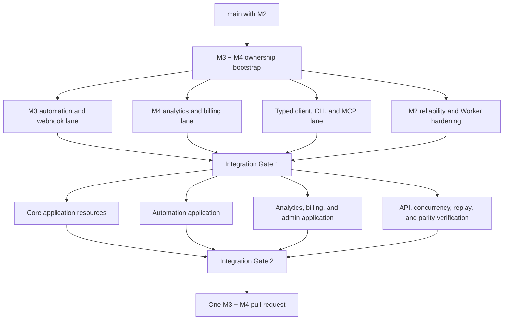

# Backend Revamp — Locked Architecture Spec

> **Status:** M0–M5 implementation is merged. M6 is implemented as one consolidated cutover and retired-runtime removal; production migration rehearsal sign-off and dashboard operations remain gated by the cutover runbook.
> **Provenance:** Wayfinder map [#141](https://github.com/thegesturs/delulu/issues/141); every decision below resolved in a closed child ticket (linked inline). Assembled and the migration plan decided in [#154](https://github.com/thegesturs/delulu/issues/154).
> **Review:** independently reviewed pre-lock by a second model (Codex `codex exec -s read-only`, 2026-07-10) — 7 findings (freeze completeness, staging-vs-routed milestones, `pendingPostIds` remap, ownership/role audits, `packages/database` downstream imports, usage-counter carry-over, `platformPosts` mapping), all fixed in this revision.
> **Rule of reading:** this document is the *index and synthesis*. Each decision's full rationale, alternatives considered, and edge-case discussion live in its ticket — zoom there before re-litigating anything here.

---

## Implementation status — M3 + M4

The M3 + M4 branch uses one integration line with isolated worker branches. Domain workers own disjoint contracts, migrations, services, and client resources; application workers start only from the green backend integration gate.



Implemented backend seams on the integration branch:

- Signed Meta, Clerk, and billing webhook ingress with a durable replay ledger.
- Postgres-authoritative automation triggers and sessions with Workers KV fast paths and repair.
- Synchronous, idempotent DM execution with lazy period rollover, reservations, soft overage, sent/skipped accounting, and provider failure-state handling.
- Operational counters, publishing streaks, versioned edge caching, live provider insights, stale fallback, pooled quota reservations, billing transfers, and reconciliation.
- Contract-derived client resources for M2–M4, one authenticated app provider, and CLI/MCP consumers without handwritten resource requests.

Production routing remains unchanged. The new Worker, bindings, webhooks, and Postgres jobs are staging-only until M6.

---

## 1. Destination

Replace the Convex backend with:

1. **Org-first Postgres data model** — single non-nullable `workspace_id` everywhere; PlanetScale Postgres.
2. **Effect core library** (Effect **v4 only**, pinned `effect@4.0.0-beta.x`) — single source of truth for types, validation, errors, and services.
3. **One Effect `HttpApi` surface** on Cloudflare Workers, consumed identically by the app, public API, CLI, and MCP. tRPC and Hono retired.
4. **Org-scoped auth** — Clerk demoted to identity provider; our own OAuth 2.1 AS; workspace-bound API keys.
5. **One-time Convex→Postgres migration** (§10) behind a waitlist gate, forward-only.

Standing principles (from repo `CLAUDE.md` + map notes):

- **Performance first. Reliability first.** Correctness and robustness over short-term convenience.
- Effect v4 idioms come from the `~/.zuse/reference-repos/effect-smol` checkout, never from v3-era web docs.
- Public API `/v1`, CLI, and MCP are free to break — no external-consumer compat required.
- No Convex crons; no external API calls in Convex actions (moot post-migration; shaped the jobs design).

Out of scope for this effort (per map): new platform OAuth integrations beyond the existing 10; the marketing site (`apps/web`); executing the revamp (that starts from this handoff).

---

## 2. Target topology

```
                    ┌─────────────────────────────────────────────┐
                    │  apps/api — Cloudflare Worker (Effect v4)   │
                    │  • whole JSON API (HttpApi contract)        │
                    │  • all platform OAuth connect callbacks     │
                    │  • webhook ingress: Meta / Clerk / Dodo     │
                    │  • own OAuth 2.1 AS endpoints               │
                    │  • rate-limit binding + Workers KV + cache  │
                    └────────┬──────────────────────┬─────────────┘
   apps/app (Next.js) ───────┤ typed client         │ Hyperdrive :5432
   apps/cli ────────────────┤ (derived from        ┌┴──────────────────┐
   apps/mcp ────────────────┘  contracts)          │ PlanetScale       │
                                                   │ Postgres (PS-5)   │
   ┌────────────────────────────────┐              └┬──────────────────┘
   │ apps/worker — AWS Lambda (Node)│ PgBouncer :6432│
   │ • publish jobs (needs Node)    ├────────────────┘
   │ • media/insights jobs          │   ┌──────────────────────────────┐
   │ • fed by SQS from the jobs     │◄──┤ Postgres jobs/outbox table + │
   │   dispatcher                   │   │ minute-tick Cron Trigger     │
   └────────────────────────────────┘   └──────────────────────────────┘
```

Package layout ([#153](https://github.com/thegesturs/delulu/issues/153)):

| Package | Role |
|---|---|
| `packages/core` | Domain `Model.Class` schemas, per-domain `Schema.TaggedErrorClass` errors, kernel (crypto/`TokenCipher`, `validateMediaFile`, ids, time) |
| `packages/contracts` | `HttpApi` definitions referencing core's schemas directly; drives server, OpenAPI/Scalar, and the derived typed client |
| `packages/services` | Cross-runtime business logic as `Context.Service`; only `apps/api` (per-request layers) and `apps/worker` (cold-start layers) compose Effect layers |
| `packages/connections` | Stays a **sibling** of core (not absorbed); upgrades to pinned Effect v4; keeps its `index.ts` (Workers-safe) vs `worker-entry.ts` (Lambda-only) export boundary — now a spec-level invariant ([#160](https://github.com/thegesturs/delulu/issues/160)) |

`apps/app`, `apps/cli`, `apps/mcp` are **pure typed-client consumers** — no Effect layer composition.

---

## 3. Decision index

Each row is locked. Gist here; full detail in the ticket.

| Area | Decision (gist) | Ticket |
|---|---|---|
| API technology | Effect v4 `HttpApi` on Workers via `HttpRouter.toWebHandler`; one contract package drives server + OpenAPI + typed client; `requiredForClient` auth compile-enforced; Hono retired with tRPC; presigned-R2 media flow kept | [#142](https://github.com/thegesturs/delulu/issues/142) |
| Postgres stack | PlanetScale Postgres (PS-5); `effect/unstable/sql` + `@effect/sql-pg` (node-postgres, Hyperdrive-documented); `Model` variants as single type source; `SqlModel.makeRepository`/`makeResolvers` CRUD + hand-written SQL/`SqlSchema` for complex reads; **no ORM**; plain-SQL migrations via PgMigrator; Hyperdrive :5432 from Workers, PgBouncer :6432 from Lambda; READ COMMITTED + opt-in serializable-retry helper + outbox | [#143](https://github.com/thegesturs/delulu/issues/143) |
| Realtime & jobs | Realtime **cut**: TanStack Query + request/response + invalidation (per-org DO hint channel designed but deferred). Jobs: transactional Postgres jobs/outbox table + minute-tick Cron Trigger dispatcher → existing SQS/Lambda worker + DLQ; replaces Convex scheduler, CallMeLater, migration chaining | [#144](https://github.com/thegesturs/delulu/issues/144) |
| Auth provider | Stay on Clerk **for identity** through the rewrite; thin Effect auth adapter isolates it; app-issued org-scoped API keys in Postgres; no Clerk client_credentials. Superseded on the AS point by #149 | [#145](https://github.com/thegesturs/delulu/issues/145) |
| Org-first domain model | Implicit permanent single-member **personal workspace** per user; single non-nullable `workspace_id` replaces `userId`/`organizationId` dual ownership; Postgres `workspace_members` is membership/role source of truth; roles `owner/admin/editor/viewer`; connections exclusive per `(platform, profile_id)` with explicit reconnect confirm; billing keyed to paying user via `billing_owner_user_id` per workspace | [#146](https://github.com/thegesturs/delulu/issues/146) |
| Post/content model | One Effect Schema replaces the triplication: normalized **content groups** (`groups[]` + `targets[]`, target→`groupId`); layout derived; body = `segments[]`; **media by reference** (`MediaRef`→`media` table, hydrate-on-read); typed provider-settings tagged union on `post_targets.settings`; two-level status (target state machine + in-transaction `rollup(targets)` on post); `deletedAt` soft delete; per-target absolute-UTC scheduling | [#147](https://github.com/thegesturs/delulu/issues/147) |
| API resource design | Resource families under `/v1/workspaces/:ws/…`: Publishing (`posts`, `posts/:id/targets`+`/retry`, `posts/bulk`, `reviews`, `media`, `connections`), Engagement (`automations/{platform}/{category}`, `…/runs`, `…/inbox`), Insights (`analytics`), Admin (`workspaces`, `members`, `api-keys`, `webhooks`); camelCase wire; offset/limit+`total` pagination; `{error:{code=_tag,…}}` envelope, 422 `ValidationError`; idempotency via `externalSubmissionId`; bulk = per-item partial failure; `/v1` additive-only | [#148](https://github.com/thegesturs/delulu/issues/148) |
| API auth | Credentials prove **identity only**; workspace always path-explicit; role resolved live from `workspace_members` (Clerk `org_id` claim never trusted for API auth); authz = role × scope intersection; API keys workspace-bound, workspace-owned, frozen-role capped at creator's; **own OAuth 2.1 AS** (audience-bound RFC 8707, custom scopes, RFC 9728 for hosted MCP), Clerk = upstream identity | [#149](https://github.com/thegesturs/delulu/issues/149) |
| Social OAuth connect | Workspace pinned at **mint-time** in a compact signed HMAC state (`{workspaceId, principal, nonce, iat}`, 10-min TTL, no server-side store); callback is public and trusts the signature (no live session); one authorization gate at the mint endpoint; state handling centralized in the connections runtime; single state-derived upsert; cross-workspace collision → explicit doubly-authorized transfer confirm; completion is pull (CLI/agents poll the connections API) | [#150](https://github.com/thegesturs/delulu/issues/150) |
| Roles & permissions | Full matrix: owner+admin publish directly + approve; editor always needs approval; viewer read-only; owner+admin manage keys/members; only owner grants owner; billing = owner role or `billing_owner_user_id` holder; Clerk gets the four custom org roles as invite UI, webhook-synced into Postgres (authoritative) | [#151](https://github.com/thegesturs/delulu/issues/151) |
| Approvals & collaboration | `pending_review`/`changes_requested` added to post status; whole-post approval v1; one cycling review row + append-only feed as audit; approval bound to a content fingerprint hash (editor edits void it); workspace-visible drafts; flat comments v1; missed slot → approver chooses reschedule-or-now; in-app notifications over typed `review.*` events; API/agent posts obey the same role gate; **no synthetic auto-approve** (review row exists iff submitter is a live editor) | [#152](https://github.com/thegesturs/delulu/issues/152) |
| Effect core library | Three packages by role (§2); `Context.Service` throughout; org scoping data-only via domain-typed `CurrentOrg`/`CurrentUser`; forward-compatible nullable `parentOrgId`; connections upgrades in place | [#153](https://github.com/thegesturs/delulu/issues/153) |
| App data layer | **No BFF**: RSC and browser both call the deployed `apps/api` directly; shared package owns `createApiClient({ getToken })` + generic `effectQuery`/`effectMutation` mapper; hand-written per-resource TanStack Query one-liners; typed errors reject as `Schema.TaggedError` instances, defects fall through as plain `Error`; existing RSC prefetch/hydration carries over | [#155](https://github.com/thegesturs/delulu/issues/155) |
| Webhook ingress & auto-DM | Meta + Clerk + Dodo consolidate on the API worker (Instagram-webhook Lambda retired); Meta KV fast-path survives via **native Workers KV binding** with synchronous write-through; automation sessions + DM sends stay synchronous inline in the webhook request (not via jobs/outbox); Clerk/Dodo writes direct + synchronous | [#156](https://github.com/thegesturs/delulu/issues/156) |
| Billing & quotas | Plan limits **pool across all workspaces a `billing_owner_user_id` backs**; transactional running counters on the subscription row + reconciliation job on Cron; flat-rate tiers (seats reserved for enterprise); billing-owner transfer = repoint-only with member+accept+own-plan preconditions; addons pool with the plan | [#157](https://github.com/thegesturs/delulu/issues/157) |
| Analytics & counting | Three regimes: (A) operational counters = on-demand `count(*) FILTER` + TanStack `staleTime` + ~30s edge cache keyed by per-workspace stats-version; streaks derived per-workspace from `posts.published_at`; (B) platform insights = **live passthrough + Workers-KV cache** (~1h TTL) — `accountInsights`/`mediaInsights`/`analyticsSyncState` **dropped, not migrated**; (C) quota meters defer to #157's mechanism; `dmsSent` = maintained atomic counter, lazy period reset | [#158](https://github.com/thegesturs/delulu/issues/158) |
| Rate limits & quota policy | (a) Rate limiting: **Cloudflare native Rate Limiting binding**, per-credential keys, `apiRatePerMinute` per plan for API keys + flat ~300/min session net; middleware order `authenticate→tier→rate-limit→quota→handler`; `429 + Retry-After`; per-colo caveat accepted; WAF handles IP/unauth. (b) Quota policy: five hard caps, block-at-creation → `402`; never break in-flight; `dmsSent` +10% soft overage then skip + `dmsSkipped`; `QuotaGuard` Effect service in-transaction; **every limit lives in `packages/payments/plans.ts`** | [#159](https://github.com/thegesturs/delulu/issues/159) |
| Runtime placement | Workers serve the whole JSON API **plus all 10 platforms' OAuth connect callbacks** (audited Workers-safe); Lambda keeps publish/insights/media jobs (genuinely Node-bound); the `connections` export boundary enforces the split | [#160](https://github.com/thegesturs/delulu/issues/160) |
| Media pipeline | Bytes never transit a Worker/Lambda: presigned PUT direct to R2; batch `/media/uploads` (pending rows + URLs) → `/media/complete` (one R2 `HEAD` for authoritative size → `mediaStorageBytes`); dims/duration/thumbnail browser-extracted advisory; hard platform caps enforced at publish in Lambda; two-tier validation (`MediaConstraints` per platform + per-platform composition rules; zod `validators/post.ts` retired); plan-tiered `mediaRetentionDays` reclamation anchored at publish, on Cron/jobs | [#161](https://github.com/thegesturs/delulu/issues/161) |

---

## 4. Migration plan (decided in #154)

### 4.1 Shape: big-bang behind a waitlist gate

- **Full write freeze, not just a signup gate.** Clerk flips to waitlist mode (no new signups) **and** the app + API go into maintenance/read-only mode, the publish worker and Convex scheduler pause, and every webhook ingress is disabled (Instagram-webhook Lambda off; Clerk/Dodo webhook endpoints paused — Dodo events are replayable from its dashboard, Clerk org-sync is moot post-migration). Nothing can mutate Convex once the export is taken. Current user count makes this a communicated pause, not an engineering problem.
- The window is **unhurried** — hours-to-days, not a sub-hour race. No dual-write, no sync layer, no reverse transform. The Postgres model differs *structurally* (posts→groups/targets, dual ownership→`workspace_id`, dropped analytics), so live sync would be throwaway engineering for a database being abandoned.
- Scheduled posts and auto-DM automations pause with the product. Meta retries webhook deliveries with backoff, and dropped DMs during the window are an accepted, communicated cost.
- **Mandatory dry-run rehearsal**: the full export→transform→import→verify pipeline runs against a production export *before* the real window — not for speed, but to surface transform edge cases (malformed legacy documents, orphaned references) ahead of time. Cutover day executes a rehearsed script.

### 4.2 Rollback stance: forward-only

- During the window, "rollback" is trivial: don't flip; Convex is untouched.
- **Once reopened, the door closes.** Bugs are fixed forward on Postgres. If a transform bug mangled data, repair it by re-reading the **frozen Convex copy** for the affected rows.
- Because production has no active users, the accepted M6 plan does not require a 14-day soak. Archive the canonical export to **R2** after the production smoke test, verify its checksum, then decommission the frozen source deployment.
- The migration CLI and `legacy_convex_id` columns remain until the production import, audit sign-off, and archive are confirmed; they are the recovery path during the operator-controlled cutover.

### 4.3 Token handling: ciphertext verbatim

- `socialProviders.accessToken`/`refreshToken` are AES-GCM blobs (PBKDF2 key from `ENCRYPTION_SECRET`, per-value random salt+IV, base64). The migration copies them **byte-for-byte as opaque strings** — no plaintext token ever materializes in the pipeline.
- The new stack keeps the same `ENCRYPTION_SECRET` and ports `encryptData`/`decryptData` into `packages/core` as a **`TokenCipher` Effect service** (Web Crypto — identical on Workers and Lambda).
- Token columns carry a **cipher version tag** (`v1` = today's format), making future key rotation a lazy background re-encrypt instead of another migration. Natural refresh cycles rotate most tokens through the new service within weeks anyway.

### 4.4 Identity & keys

- **Primary keys:** application-generated, entity-prefixed Nano IDs with 12 URL-safe random characters (for example, `user_V1StGXR8_Z5j` and `workspace_2nYxKp4Lq9Dm`). PostgreSQL stores primary and foreign keys as `text`; Effect schemas enforce the correct prefix at service boundaries. Every migrated row keeps a **`legacy_convex_id text unique`** column (nullable, indexed) for soak-period traceability and frozen-copy repairs; dropped in a post-soak contract migration.
- **FK remapping:** the transform builds an in-memory `convexId → Nano ID` map per table and rewrites all references in dependency order (users → workspaces → members → providers → media → posts → …).
- **Timestamps:** Convex `_creationTime` (ms float) → `timestamptz created_at`; numeric `updatedAt`/epoch fields likewise.
- **Users:** `externalId` (Clerk user id) is the identity join key and is preserved verbatim.
- **R2 media bytes are not migrated** — objects stay in place; `bucketKey` carries over unchanged.

### 4.5 Table-by-table disposition

| Convex table | Disposition | Notes |
|---|---|---|
| `users` | **Migrate + synthesize** | One row each; **create an implicit personal workspace per user** (#146) with the user as `owner` and `billing_owner_user_id`. `stats.publishDates[]` dropped — streaks derive from `posts.published_at` (#158). **`usage.{monthlyPosts, dmsSent, transcriptionsUsed}` + their period anchors carry over** into the new pooled counters (no free quota reset mid-period); `monthlyPosts` and `mediaStorageBytes` are then recomputed by the reconciliation query, which must agree with the carried values |
| `organizations` | **Migrate** → `workspaces` | Keep `clerkOrgId` linkage for the Clerk invite-UI sync (#151) |
| `organizationMembers` | **Migrate** → `workspace_members` | **Role mapping:** org creator → `owner`; `admin` → `admin`; everyone else → `editor`. Nobody lands as `viewer` implicitly |
| `posts` | **Migrate with transform** | The big one: flat legacy shape → posts + content groups + targets (#147). Legacy default+exceptions content → one group per distinct content variant, targets pointed at their group; statuses recomputed via `rollup(targets)`; `isDeleted` → `deletedAt`; `searchableText` → Postgres `tsvector` generated column; media references become `MediaRef`s against migrated media ids. **Embedded `platformPosts[]` publish results map onto targets** (matched by provider id): `platformPostId`, `platformPostUrl`, `postedAt`, `failureReason` land on the corresponding target row so published/failed history survives |
| `socialProviders` | **Migrate** → connections table | Ciphertext verbatim (§4.3); `userId`-owned rows → the owner's personal workspace; `organizationId`-owned rows → that workspace. `(platform, profile_id)` uniqueness enforced at import — collisions surface in the dry run and are resolved manually before cutover |
| `media` | **Migrate** | Status `ready`; summed sizes seed each billing owner's `mediaStorageBytes` counter (#157) |
| `subscriptions` | **Migrate** | Keyed to `billing_owner_user_id`; quota counters seeded by running the reconciliation query once post-import |
| `transactions` | **Migrate** | Payment history, straight copy |
| `apiKeys` | **Drop — re-mint** | #149 changed key semantics (workspace-bound, role-capped, scoped); `/v1` is free to break; users re-mint under the new model |
| `automations` | **Migrate with transform** | Workspace-scoped via their provider's workspace. Trigger configs embed **`pendingPostIds` (Convex post ids)** used by post-publish linking — remapped through the id map; entries pointing at dropped/deleted posts are pruned |
| `automationMediaTriggers` | **Rebuild** | Denormalized lookup; regenerate from migrated automations post-import, then write-through to Workers KV (#156) |
| `automationSessions` | **Drop** | Ephemeral mid-conversation state; all sessions are stale after the window. Active DM conversations reset |
| `automationContacts` | **Migrate** | Collected end-user data (emails) — irreplaceable |
| `automationLogs` | **Migrate** → automation runs | Only record of DMs sent; lands in #148's `…/runs` history |
| `postReviews` | **Migrate** | Into #152's one-cycling-review-row model |
| `reviewActivity` | **Migrate** | Append-only feed = audit trail |
| `accountInsights` | **Drop** | #158: live passthrough replaces stored insights |
| `mediaInsights` | **Drop** | #158 |
| `analyticsSyncState` | **Drop** | #158; sync worker retired |
| `transcriptions` | **Migrate** | Sorted extension data; `text` → `tsvector` for search |

### 4.6 Tooling

- A standalone **one-off migration CLI** (`scripts/migrate-convex/`, Effect v4, Node): reads a **Convex snapshot export** (`npx convex export` → ZIP of JSONL per table), transforms in memory, writes via `@effect/sql-pg` (direct :5432, not through Workers).
- **Idempotent by reload:** each run truncates the migrated tables and reloads from the snapshot — re-running after a fix is always safe during the window.
- **Verification suite** runs after import and must pass before reopening:
  - Row-count parity per table (minus intentional drops) against the export.
  - FK integrity + orphan scan (every target→group, MediaRef→media, member→workspace resolves).
  - #147 invariants: every post's stored status equals `rollup(targets)`; every target has exactly one group.
  - Sampled deep-equality: N random documents per table, transformed independently and compared field-by-field.
  - Token spot-check: decrypt a sample of migrated ciphertexts with the ported `TokenCipher` (proves key + format survived).
  - Quota seed check: recomputed counters match the reconciliation query **and** the carried-over `users.usage` values.
  - **Ownership audit** (authorization-critical): every migrated row that had legacy `userId`/`organizationId` dual ownership (posts, providers, media, automations) is asserted to land in the *intended* `workspace_id` — `organizationId`-set → that org's workspace, else → the user's personal workspace; zero rows may fall through to a default.
  - **Role-mapping audit**: the full `organizationMembers` → `workspace_members` role table (creator→owner, admin→admin, else→editor) is emitted as a human-readable report and eyeballed during the dry run — role escalation bugs are silent otherwise.

### 4.7 Cutover runbook (the rehearsed script)

The executable operator checklist, abort gates, exact migration commands,
dashboard changes, smoke tests, and monitoring requirements live in
[`cutover-runbook.md`](./cutover-runbook.md). No maintenance-page code is
required because production has no active users; the write freeze is an
operator action. The latest rehearsal artifact record is in
[`m5-rehearsal-signoff.md`](./m5-rehearsal-signoff.md).

---

## 5. tRPC retirement & package disposition

The new stack was built in parallel and `apps/app` now consumes the typed client. This M6 change removes the retired runtime wholesale; there is no hybrid production route.

Retired at cutover (deleted, not deprecated):

| Surface | Fate |
|---|---|
| `packages/api` (tRPC routers + Hono) | **Deleted**; replaced by `packages/contracts` + `apps/api`. Its unused OAuth-state helper was not moved because the connections runtime already owns signed state (#150) |
| `apps/app/trpc` + in-process router | **Deleted**; replaced by the shared typed-client package (#155) |
| `packages/database` (Convex) | **Deleted** after plan-limit and transcription consumers were moved to Postgres-backed packages. The standalone migration CLI remains self-contained until production import and archive sign-off |
| `packages/rate-limit` (Upstash, unused) | **Deleted** (#159) |
| `packages/validators` `post.ts` zod | **Deferred**; it remains a live app/connections dependency and is not part of the runtime cutover |
| CallMeLater dependency | **Deleted**; replaced by the jobs table + Cron dispatcher (#144, #161) |
| Instagram-webhook Lambda | **Deleted**; ingress consolidated on the API worker (#156) |
| Analytics sync worker | **Deleted**; live passthrough + KV cache (#158) |

---

## 6. Implementation milestones

M0–M5 established and rehearsed the Postgres stack without changing production routing. M6 packages the routing configuration and retired-runtime deletion in one change; the external production flip still follows §4.7. No dual-running or feature-flag interleaving is introduced.

- **M0 — Foundations.** Pin `effect@4.0.0-beta.x` workspace-wide. Scaffold `packages/core` / `contracts` / `services`. Postgres schema v1 + PgMigrator setup. `TokenCipher`, ids, time, `validateMediaFile` in core kernel. CI: typecheck + migration-lint + `swift`-style boundary check for the connections export split (#160).
- **M1 — API skeleton + auth.** `apps/api` Worker serving the HttpApi contract; Clerk JWT verification + `CurrentUser`/`CurrentOrg` context; `workspace_members` live role resolution; rate-limit binding + `QuotaGuard` middleware chain (#159); minimal own-AS (auth-code + PKCE + refresh + RFC 9728) for CLI/MCP (#149).
- **M2 — Domain services on Postgres.** Posts/groups/targets model + rollup (#147); media pipeline endpoints (#161); connections upsert + mint/callback with signed state (#150); workspaces/members/api-keys admin family (#148); reviews + activity feed (#152); jobs table + Cron dispatcher feeding SQS/Lambda (#144); Lambda publish path reads Postgres.
- **M3 — Webhook ingress + automations.** Meta/Clerk/Dodo consolidated on the Worker; KV fast-path write-through; synchronous auto-DM path; `dmsSent`/`dmsSkipped` counters (#156, #158, #159).
- **M4 — Consumers.** Shared typed-client package + TanStack Query mapper; `apps/app` wholesale swap on a branch (#155); CLI + MCP on the same client; analytics passthrough + edge-cached operational counters (#158). Billing webhooks + quota pooling + transfer flow (#157).
- **M5 — Migration tooling + rehearsal.** The `scripts/migrate-convex` CLI and verification suite are merged. Existing local artifacts are not a coherent green-twice sign-off; §4.7 requires a same-export production rehearsal and report review before routing.
- **M6 — Cutover.** **Implementation prepared.** Retired packages and infrastructure are removed in one PR. Execute §4.7, archive the verified export, then decommission the source deployment. Drop `legacy_convex_id` and retire the migration CLI only after production import/archive sign-off.

---

## 7. Deferred (survives this effort as map fog / future work)

- **Per-org Durable Object invalidation-hint channel** — designed in #144, adopted later on need.
- **Org hierarchy / white-labeling** — `parentOrgId` hooks exist (#146, #153); hierarchy and permission cascade undesigned.
- **Third-party OAuth app onboarding** — developer portal, CIMD/DCR, consent policies (#149); our own CLI + MCP ship on the minimal AS first.
- **Per-target approval**, **anchored comments**, **email notification consumer** — explicitly v2 in #152.
- **Generic `Idempotency-Key` header** — noted in #148; `externalSubmissionId` ships first.
- **Global (cross-colo) rate caps via DO** — only if a specific path needs a provably-global limit (#159).
